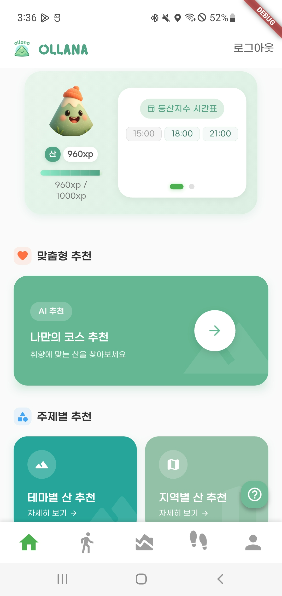
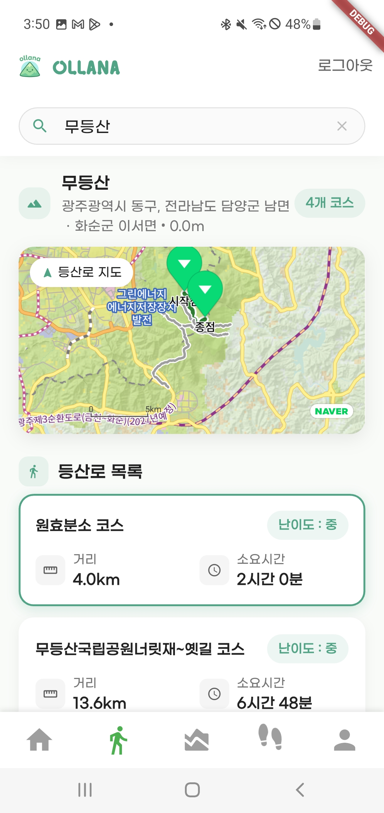
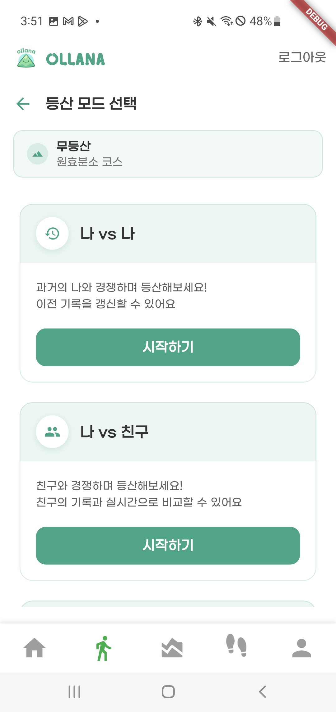
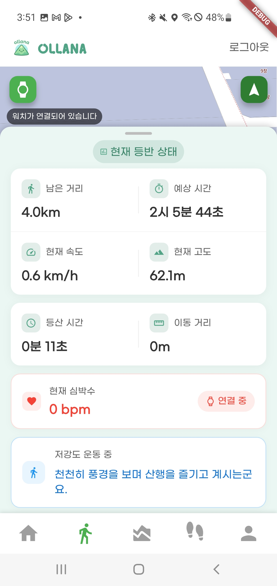
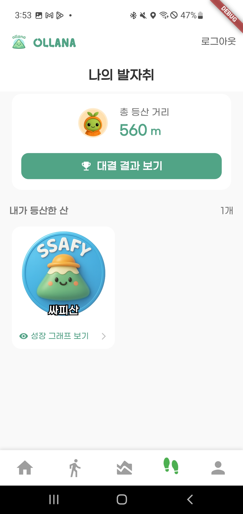

# 🏔️ Ollana - 등산 도우미 어플리케이션

  

> **“나 vs 나, 유저 vs 유저” — 더욱 도전적인 산행을 위한 새로운 방식!**

---

## 🧠 프로젝트 소개

**Ollana**는 등산 기록을 시각화하고, 친구와 비교하며, 실시간 페이스 조절 기능을 제공하는 **스마트 산행 도우미 앱**입니다.  
**개인화된 등산 경험**을 통해 더 즐겁고 효율적인 산행을 돕습니다.

📈 **산행 인구 증가 참고 기사**  
- [전기신문 - 매년 늘어나는 등산·도보 인구](https://www.electimes.com/news/articleView.html?idxno=327204)  
- [뉴스TNT - 성인 10명 중 8명, 한 달에 한 번 이상 산행](https://www.newstnt.com/news/articleView.html?idxno=252898)

---

## 📅 개발 기간

🗓️ **2025.04.21 ~ 2025.05.22**

---

## 🧩 기술 스택

### 🖥️ Backend  

### 📱 Frontend  

### ⚙️ DevOps & CI/CD  

---

## 🌟 팀원 소개

| 장희주 | 신우진 | 황학선 | 김시아 | 박찬미 | 강건준 |
|--------|--------|--------|--------|--------|--------|
|  |  |  |  |  |  |
| [@jang-huiju](https://github.com/jang-huiju)  🎯 Leader / Back End | [@zebra0345](https://github.com/zebra0345)  🛠️ DevOps / AI | [@HHS-97](https://github.com/HHS-97)  🎨 Front End | [@thesiakim](https://github.com/thesiakim)  🔁 Full Stack | [@chaaaaaaanmi](https://github.com/chaaaaaaanmi)  🧩 Back End | [@kang-geon-jun](https://github.com/kang-geon-jun)  🎨 Front End |

---
## 시스템 다이어그램

---

## 📦 배포 전략

### 1️⃣ 인프라 구성 (`docker-compose.yml`)
- Jenkins / Redis / PostgreSQL

### 2️⃣ 서비스 배포 (`docker-compose-deploy.yml`)
- SpringBoot / FastAPI
- `.env` 대신 **환경변수는 텍스트 기반 개별 관리**

---

## 📱 주요 기능

| 기능 | 설명 |
|------|------|
| 🏃‍♂️ **실시간 페이스 메이커** | 고도/심박수 기반 실시간 강도 분석 및 속도 조절 |
| 🏅 **배지 수집 시스템** | 산 별 등반 기록으로 유저에게 보상 제공 |
| 👥 **기록 경쟁 기능** | 친구 혹은 나 자신과 기록 비교 |
| 📊 **운동 기록 시각화** | 거리, 고도, 시간, 심박수 등 시각 분석 제공 |

---

## 📸 주요 화면 구성

### 메인화면

- 등산지수 시간대별 확인
- AI 기반 맞춤 산 추천
- 테마별/지역별 추천 기능

### 산 정보 확인

- 등산로, 거리, 시간, 난이도 확인
- 위치 기반 맞춤 경로 추천

### 등산 모드 선택

- 모드 선택: 나 vs 나 / 나 vs 친구
- 기록 기반 비교 가능

### 등산 분석

- 고도/심박/거리 분석
- 템포 조절 가이드 제공

### 나의 발자취

- 산행 배지 수집
- 누적 거리 및 기록
- 대결 결과 요약 제공

---
