# 🏔️ Ollana : 등산 도우미 어플리케이션

  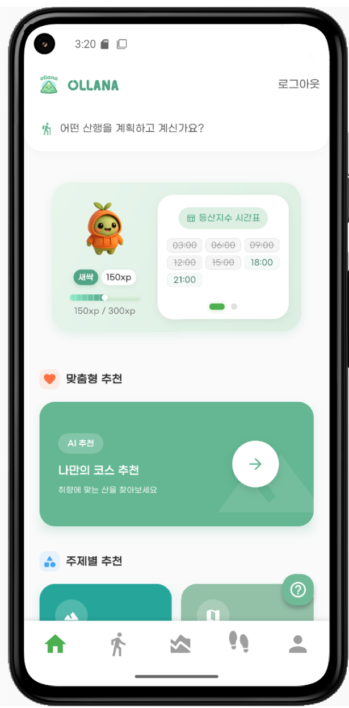

> **“나 vs 나, 유저 vs 유저” — 더욱 도전적인 산행을 위한 새로운 방식!**

---

## 🧠 프로젝트 소개

**Ollana**는 등산 기록을 시각화하고 친구와 비교하며 실시간 페이스 조절 기능을 제공하는 **스마트 산행 도우미 앱**입니다.  
**개인화된 등산 경험**을 통해 더 즐겁고 효율적인 산행을 도울 수 있습니다.

📈 **산행 인구 증가 참고 기사**  
- [전기신문 - 매년 늘어나는 등산·도보 인구](https://www.electimes.com/news/articleView.html?idxno=327204)  
- [뉴스TNT - 성인 10명 중 8명, 한 달에 한 번 이상 산행](https://www.newstnt.com/news/articleView.html?idxno=252898)

---

## 📅 개발 기간

🗓️ **2025.04.21 ~ 2025.05.22**

---

## 🧩 기술 스택

### 🖥️ Backend  

### 📱 Frontend  

### ⚙️ DevOps & CI/CD  

---

## 🌟 팀원 소개

| 장희주 | 신우진 | 황학선 | 김시아 | 박찬미 | 강건준 |
|--------|--------|--------|--------|--------|--------|
|  |  |  |  |  |  |
| [@jang-huiju](https://github.com/jang-huiju)  🎯 Leader / Back End | [@zebra0345](https://github.com/zebra0345)  🛠️ DevOps / AI | [@HHS-97](https://github.com/HHS-97)  🎨 Front End | [@thesiakim](https://github.com/thesiakim)  🔁 Full Stack | [@chaaaaaaanmi](https://github.com/chaaaaaaanmi)  🧩 Back End | [@kang-geon-jun](https://github.com/kang-geon-jun)  🎨 Front End |

---
## 🔗 프로젝트 아키텍처 

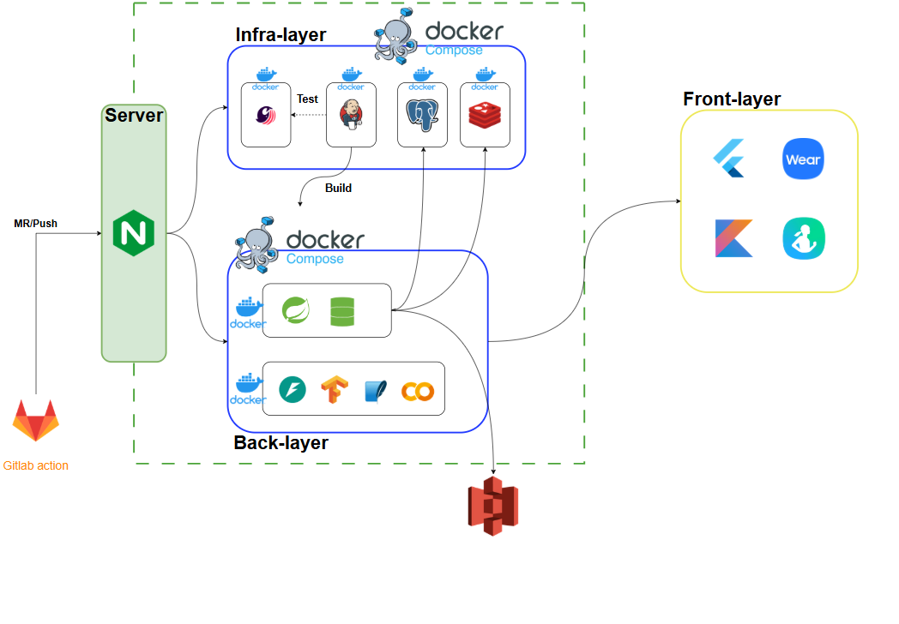

---

## 📦 배포 전략

### 1️⃣ 인프라 구성 (`docker-compose.yml`)
- Jenkins / Redis / PostgreSQL

### 2️⃣ 서비스 배포 (`docker-compose-deploy.yml`)
- SpringBoot / FastAPI
- `.env` 대신 **환경변수는 텍스트 기반 개별 관리**

---

## 📱 주요 기능

| 기능              | 설명                          |
|-----------------|-----------------------------|
| **실시간 페이스 메이커** | 고도/심박수 기반 실시간 강도 분석 및 속도 조절 |
| **뱃지 수집 시스템**   | 산 별 등반 기록으로 유저에게 뱃지 제공      |
| **기록 경쟁 기능**    | 친구 혹은 나 자신과 기록 비교           |
| **운동 기록 시각화**   | 거리, 고도, 시간, 심박수 등 시각 분석 제공  |

---

## 📸 주요 화면 구성

### ⚙ 메인화면
|                         |                             |
|-------------------------|-----------------------------|
|  |  |
| 홈 화면                    | 산 추천                        |

- 도움말 조회
- 시간대별 등산지수 (날씨 정보) 조회
- AI 기반 맞춤 산 추천
- 테마별/지역별 산 추천

### ⚙ 회원가입 및 설문조사

|                             |                             |
|-----------------------------|-----------------------------|
|  |  |
| 회원가입                        | 설문조사                        |

- 회원가입 후 AI 기반 맞춤 산 추천 조회 시 설문조사 안내 
- 해당 설문조사 결과를 기반으로 산 추천 수행

### ⚙ 로그인

|                      |                            |
|----------------------|----------------------------|
| 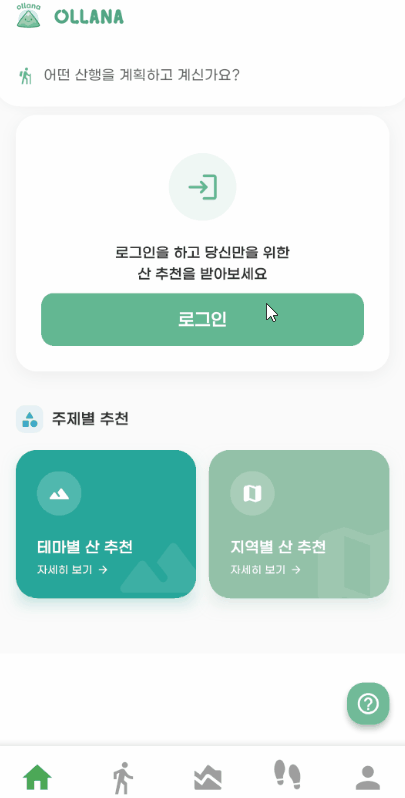 |  |
| 일반                   | 소셜                         |

### ⚙ 마이페이지

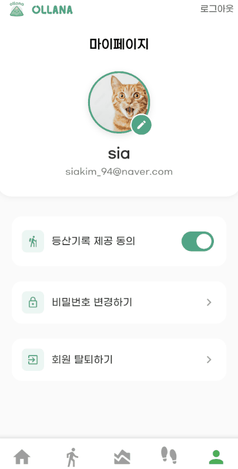

- 등산기록 제공에 동의할 경우 다른 유저가 [나 vs 친구] 모드로 트래킹할 수 있음
- 동의하지 않을 경우 [나 vs 친구] 모드에서 친구 검색 결과에 노출되지 않음

### ⚙ 나의 발자취

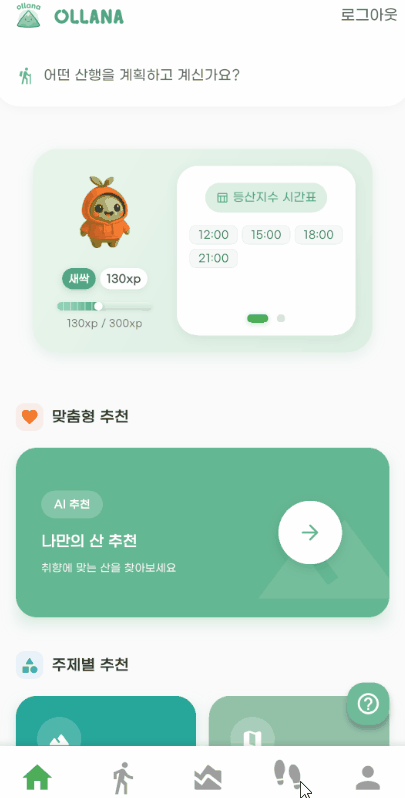

- 등산하면서 내가 걸은 총 거리 조회
- [나 vs 친구] 모드에서 등산한 결과 조회
- 내가 등산한 산의 뱃지 목록 조회
- 특정 산에 대해 내가 등산한 등산로별 데이터(최고 심박수, 평균 심박수, 소요 시간)를 날짜별로 조회
  - 그래프로 시각화
  - 날짜 한 개 클릭 시 상세 데이터 조회 가능
  - 날짜 두 개 클릭 시 두 날짜의 데이터 비교 가능
  - 이전 기록을 확인하고 싶을 경우 날짜별 조회 가능 

### ⚙ 산 정보 조회
|                     |                                               |
|---------------------|-----------------------------------------------|
| 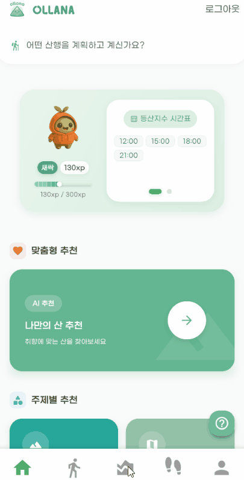 |  |
| 지도                  | 일반 목록                                         |
- 지도에서 산 클릭 시 해당 위치로 포커싱
- 일반 목록에서 산 조회 시 높이, 난이도, 위치, 날씨 정보, 등산로 위치 및 소요 시간 확인 가능

### ⚙ 등산 모드 선택

- [일반 모드], [나 vs 나], [나 vs 친구] 선택 
  - [일반 모드] : 과거의 기록과 실시간으로 비교하지 않고 등산하는 모드
  - [나 vs 나] : 내가 선택한 산, 등산로에 대해 과거의 내 기록과 실시간으로 비교하며 등산하는 모드
  - [나 vs 친구] : 내가 선택한 산, 등산로에 대해 과거의 친구 기록과 실시간으로 비교하며 등산하는 모드
- [나 vs 나]의 경우 이전 기록이 없는 경우 선택 불가 알림
- [나 vs 친구]의 경우 친구 검색 시 이전 기록 존재 여부 확인 가능
- 어떤 기록과 경쟁할 것인지 선택 가능

### ⚙ 실시간 등산 (app)
|                                 |                                         |
|---------------------------------|-----------------------------------------|
|  |  |
| 등산 중                            | 등산 완료                                   |
- 현재 위치 및 선택한 등산로의 경로 시각화
- 심박수, 남은 거리, 예상 시간, 현재 속도, 이동거리 등 실시간 데이터 확인 가능
- [나 vs 나], [나 vs 친구] 모드의 경우 하단에 경쟁 상대의 데이터 조회 가능
- 선택한 등산로의 마지막 지점으로부터 반경 50m 안에 있는 경우 목적지 도착 알림

### ⚙ 실시간 등산 (watch)

|                         |                         |
|-------------------------|-------------------------|
| 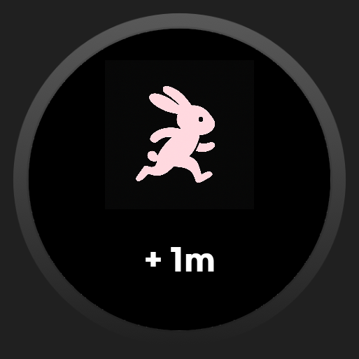 | 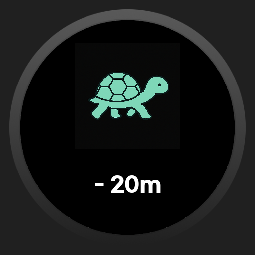 |
| 경쟁 상대보다 빠른 경우           | 경쟁 상대보다 느린 경우           |

- [나 vs 나], [나 vs 친구] 모드의 경우 경쟁 상대의 기록과 비교한 결과 알림

|                                             |                                       |                                           |
|---------------------------------------------|---------------------------------------|-------------------------------------------|
| 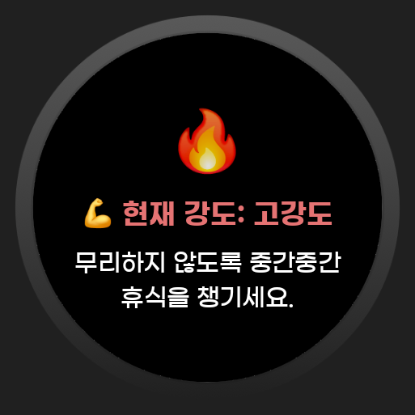 | 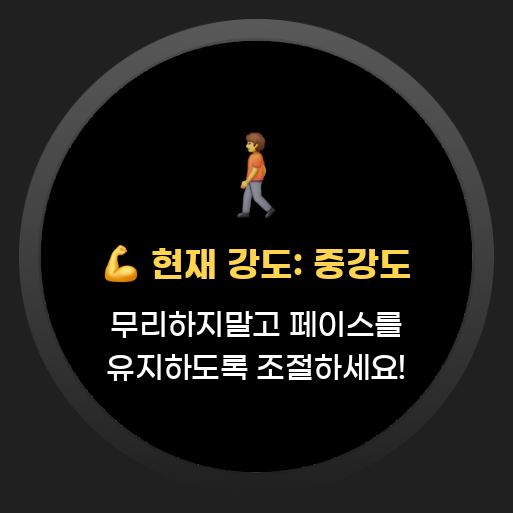 | 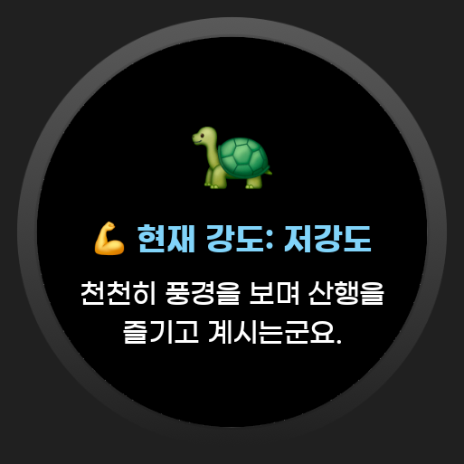 |
| 고강도                                         | 중강도                                   | 저강도                                       |
- 페이스메이커 기능
- 사용자의 심박수, 걸음을 분석하여 고강도, 중강도, 저강도 알림

|                             |                           |
|-----------------------------|---------------------------|
|  | 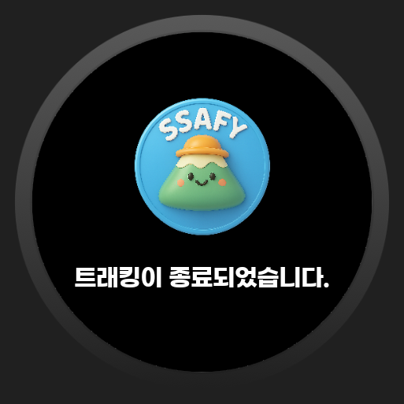 |
| 등산 종료 알림                    | 뱃지                        |
- 선택한 등산로의 마지막 지점으로부터 반경 50m 안에 있는 경우 목적지 도착 알림
- 등산에 성공한 경우 해당 산에 대한 뱃지 획득 알림